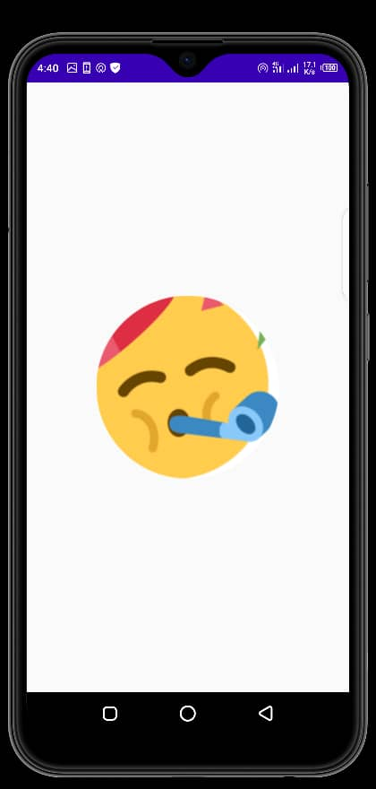
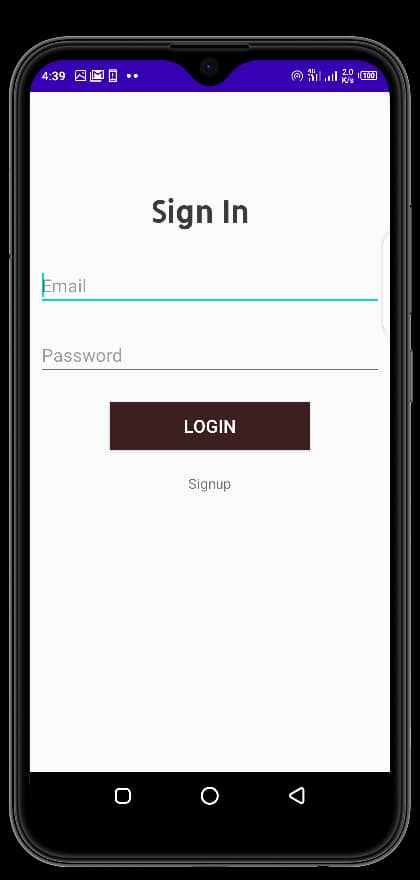
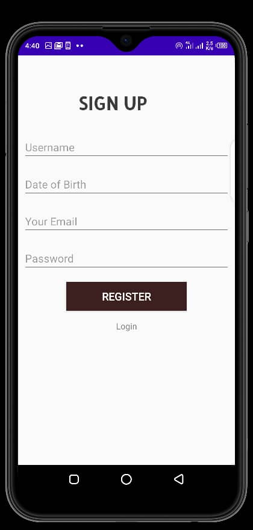
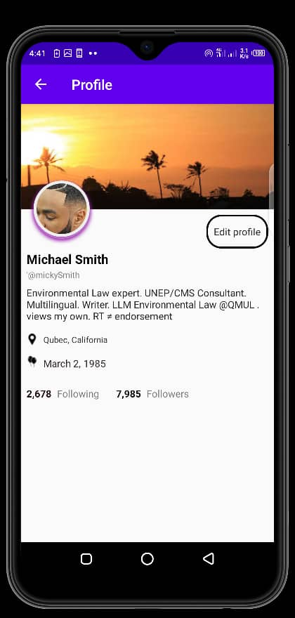
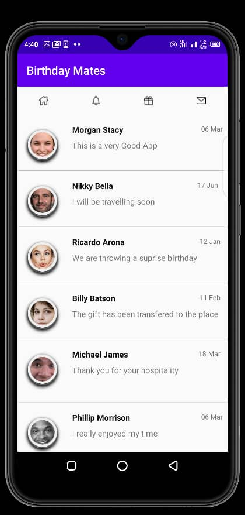

# birthdaymate-mobile-app-java

BirthdayMate android app is built with java to run on android powered mobile devices.

At the completion of this app, It is should to be able to make resful request to a play server written in java to exchange json data and perform crude operations.

Some of the screenshots are below

## Splash screen

## Login

## Registration

## Profile

## Home

##Message
